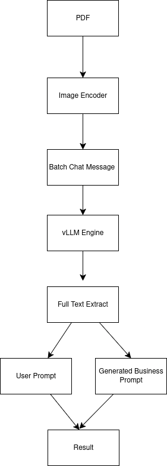

## Discovery - Document Analytics


- Visit : [https://app.dwani.ai](https://app.dwani.ai)


 


```bash
sudo apt-get update
sudo apt-get install poppler-utils -y
```


- Client

```bash
python ux/ux.py
```
- Server
```bash    
export VLLM_IP="your_vllm_ip"
uvicorn server.main:app --host 0.0.0.0 --port 18889
```

- VLLM Server setup - [server/vlm/README.md](server/vlm/README.md)

---


- Step to Run Locally [docs/local_run.md](docs/local_run.md)


---

- Docker build steps - [docs/build_docker.md](docs/build_docker.md)